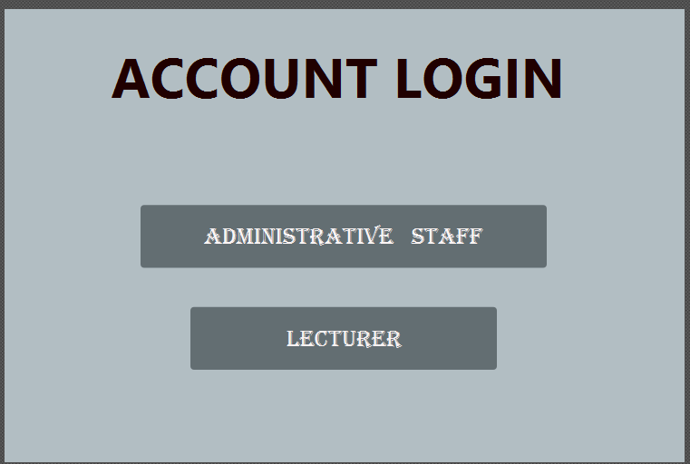
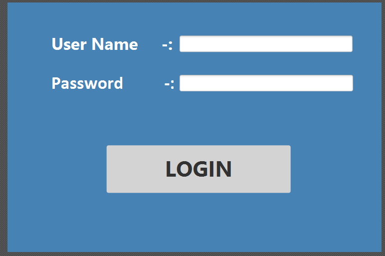

# Student Attendance Management System
> **Architecture:** Layered Architecture 

[cite_start]This is a Java-based desktop application that facilitates the tracking and reporting of student attendance for educational institutions[cite: 3].

---

## 👥 User Roles & Login

[cite_start]The system serves two primary roles, each requiring different login credentials[cite: 4, 9]:

| Role | Username | Password |
| :--- | :--- | :--- |
| [cite_start]**Administrative Staff** [cite: 5] | [cite_start]`admin` [cite: 10] | [cite_start]`Admin123` [cite: 10] |
| [cite_start]**Lecturer** [cite: 5] | [cite_start]`lecturer` [cite: 10] | [cite_start]`Lec123` [cite: 10] |


---

## ✨ Features

| # | Functional Area | Description | UI Window |
| :-: | :--- | :--- | :--- |
| **1** | [cite_start]**Course Management** [cite: 14] | [cite_start]Manage all available courses and associated subjects offered by the institution[cite: 14]. | [cite_start]COURSE MANAGEMENT [cite: 14] |
| **2** | [cite_start]**Student Management** [cite: 15] | [cite_start]Store and maintain student profiles including name, registration number, enrolled course, and contact details[cite: 15]. | [cite_start]STUDENT MANAGEMENT [cite: 15] |
| **3** | [cite_start]**Lecturer Management** [cite: 15] | [cite_start]Maintain lecturer profiles and record their assigned teaching subjects[cite: 15]. | [cite_start]LECTURER MANAGEMENT [cite: 15] |
| **4** | [cite_start]**Class Scheduling** [cite: 15] | [cite_start]Create and manage class schedules specifying the course, subject, date, time, and assigned lecturer[cite: 15]. | [cite_start]CLASS SCHEDULING [cite: 15] |
| **5** | [cite_start]**Attendance Marking** [cite: 15] | [cite_start]Enable lecturers to record and update student attendance on a per-class-session basis[cite: 15]. | [cite_start]ATTENDANCE MANAGEMENT [cite: 15] |
| **6** | [cite_start]**Attendance Reporting** [cite: 15] | [cite_start]View attendance reports filterable by student, subject, or date range, supporting administrative decision-making[cite: 15]. | [cite_start]ATTENDANCE REPORT [cite: 15] |

---

## 🏗️ Architecture

[cite_start]The project follows a **Layered Architecture** to separate concerns and improve maintainability[cite: 17]:

* [cite_start]**Controller Layer:** Manages the UI and user interactions[cite: 18].
* [cite_start]**Service Layer (BO):** Handles all business logic and orchestrates data flow[cite: 19].
* [cite_start]**DAO Layer:** Responsible for all data access operations, abstracting the database from the rest of the application[cite: 20].
* [cite_start]**DTO Layer:** Data Transfer Objects used to carry data between layers[cite: 21].
* [cite_start]**Factory Pattern:** A `DAOFactory` is used to provide the necessary DAO implementations to the service layer, promoting loose coupling[cite: 22].

---

## 🛠️ Tech Stack

* [cite_start]**Frontend & Core:** Java / JavaFX (Scene Builder) [cite: 24]
* [cite_start]**Database Connectivity:** JDBC [cite: 25, 28]
* [cite_start]**Database Backend:** MySQL [cite: 26, 29]
* [cite_start]**Version Control:** Git & GitHub [cite: 27, 30]

---

## 🚀 How To Run

### 1. Clone the repository
```bash
git clone [https://github.com/anjula201a-del/studentattendancemanagementsystem.git](https://github.com/anjula201a-del/studentattendancemanagementsystem.git)
[cite_start]
http://googleusercontent.com/immersive_entry_chip/0
