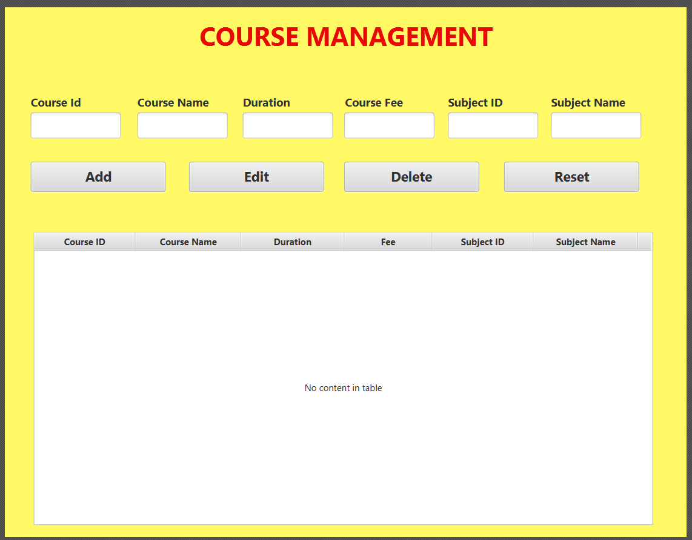
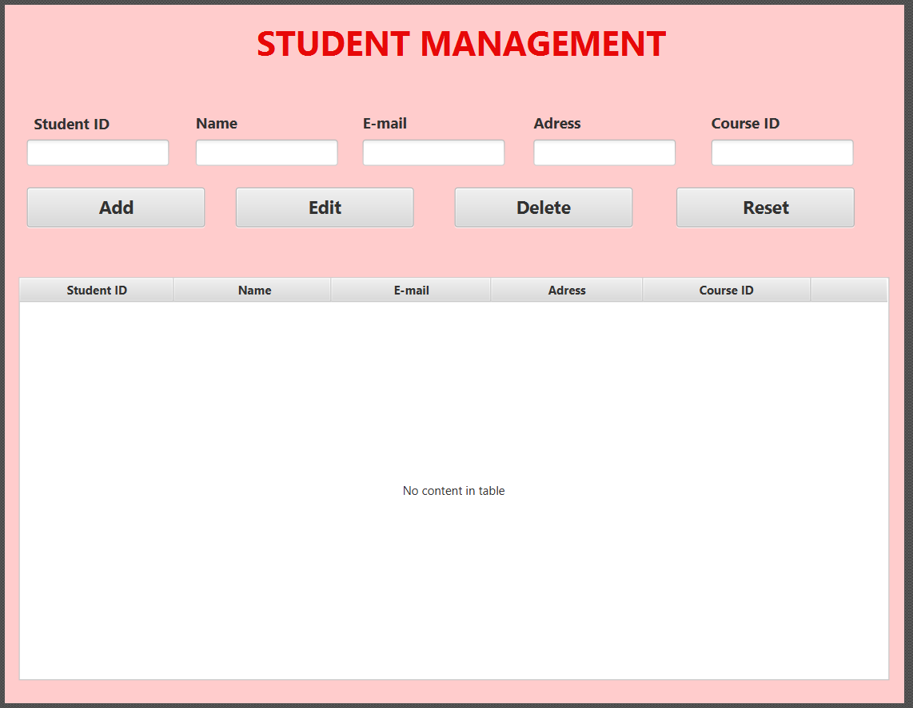
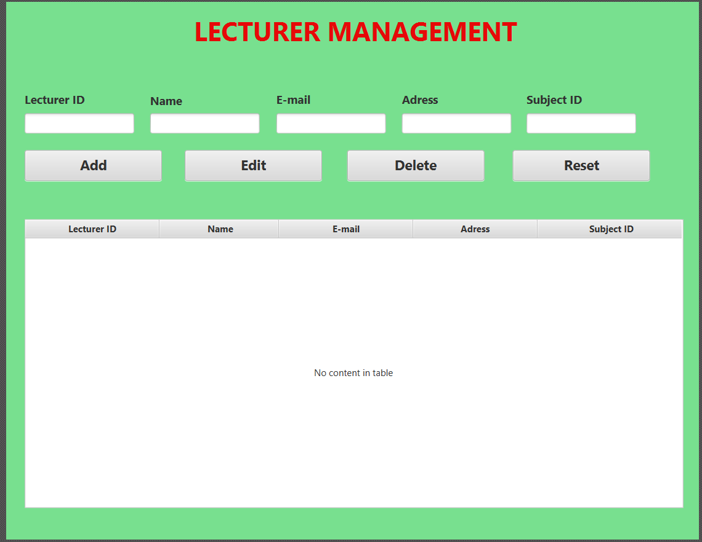
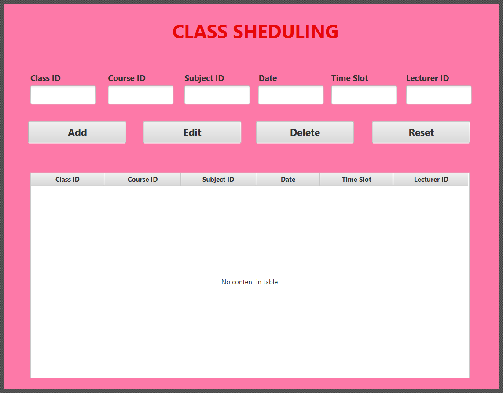
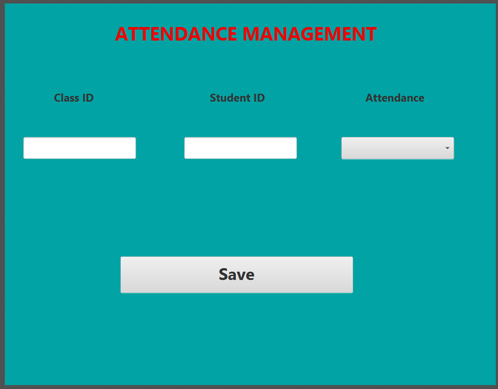
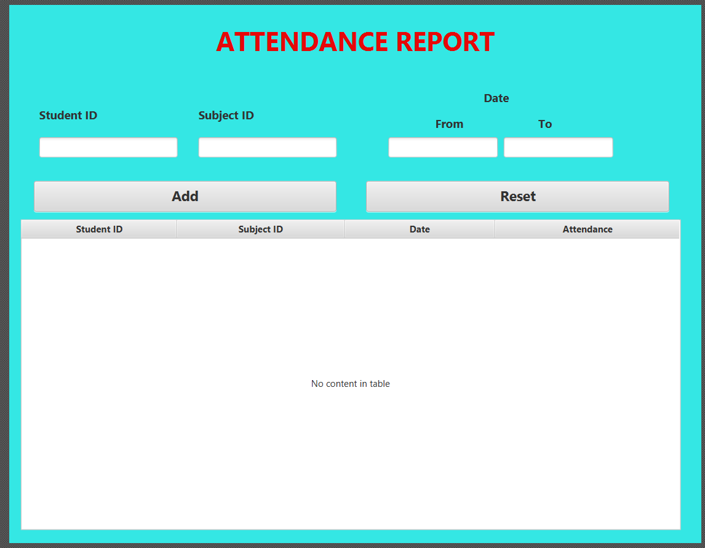

# Student Attendance Management System
> **Architecture:** Layered Architecture 

This is a Java-based desktop application that facilitates the tracking and reporting of student attendance for educational institutions[cite: 3].

---

## 👥 User Roles & Login

[cite_start]The system serves two primary roles, each requiring different login credentials[cite: 4, 9]:

| Role | Username | Password |
| :--- | :--- | :--- |
| **Administrative Staff**  | `admin` | `Admin123`  |
| **Lecturer**  | `lecturer`  | `Lec123`  |


---

## ✨ Features

| # | Functional Area | Description | UI Window |
| :-: | :--- | :--- | :--- |
| **1** | **Course Management**  | Manage all available courses and associated subjects offered by the institution. |   |
| **2** |**Student Management** | Store and maintain student profiles including name, registration number, enrolled course, and contact details. | |
| **3** | **Lecturer Management**  | Maintain lecturer profiles and record their assigned teaching subjects. | |
| **4** | **Class Scheduling**  | Create and manage class schedules specifying the course, subject, date, time, and assigned lecturer. | |
| **5** | **Attendance Marking** | Enable lecturers to record and update student attendance on a per-class-session basis. ||
| **6** | **Attendance Reporting**  | View attendance reports filterable by student, subject, or date range, supporting administrative decision-making |   |

---

## 🏗️ Architecture

The project follows a **Layered Architecture** to separate concerns and improve maintainability[cite: 17]:

* **Controller Layer:** Manages the UI and user interactions.
* **Service Layer (BO):** Handles all business logic and orchestrates data flow.
* **DAO Layer:** Responsible for all data access operations, abstracting the database from the rest of the application.
* **DTO Layer:** Data Transfer Objects used to carry data between layers.
* **Factory Pattern:** A `DAOFactory` is used to provide the necessary DAO implementations to the service layer, promoting loose coupling.

---

## 🛠️ Tech Stack

* **Frontend & Core:** Java / JavaFX (Scene Builder)
* **Database Connectivity:** JDBC
* **Database Backend:** MySQL 
* **Version Control:** Git & GitHub 

---

## 🚀 How To Run

### 1. Clone the repository
```bash
git clone [https://github.com/anjula201a-del/studentattendancemanagementsystem.git](https://github.com/anjula201a-del/studentattendancemanagementsystem.git)

http://googleusercontent.com/immersive_entry_chip/0
